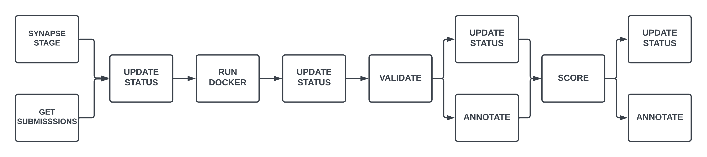

# nf-model2data
This Nextflow Workflow was created to run model-to-data challenges.

## Prerequisites

In order to use this workflow, you must already have completed the following steps:

1. Created a Synapse project shared with challenge participants.
2. Created an evaluation queue within the Synapse project.
3. One or more Docker containers must have already been submitted to your evaluation queue.
4. Created a submission view that at least includes the `id`, `status`, `dockerrepositoryname`, and `dockerdigest` columns.
    - Note: This workflow was developed and tested using [this repo](https://github.com/Sage-Bionetworks-Challenges/sample-model-templates/tree/main/python) as an example submission, and submissions evaluated using this workflow must follow the same format (i.e. model submission should expect input data in `/input` directory and place exported files in `/ouput` directory).
5. Added the input data for evaluating submissions to a folder within your Synapse project.

## Running the workflow

The workflow takes several inputs. They are:

1. `view_id` (required): The Synapse ID for your submission view.
2. `input_id` (required): The Synapse ID for the folder holding the testing data for submissions.
3. `cpus` (optional): Number of CPUs to dedicate to the `RUN_DOCKER` process i.e. the challenge executions. Defaults to `4`
4. `memory` (optional): Amount of memory to dedicate to the `RUN_DOCKER` process i.e. the challenge executions. Defaults to `16.GB`

The Default parameter values for `view_id` and `input_id` currently point to a Synapse project that only DPE members have access to. Unless you have access to the `DPE-Testing` Synapse project, you will not be able to test this workflow using the default values. Additionally, this workflow expects a secret called `SYNAPSE_AUTH_TOKEN` (a Synapse Authentication Token). This secret should be configured in your local copy of Nextflow for local runs, or as a workspace secret in your Nextflow Tower workspace.

Run the workflow locally:
```
nextflow run main.nf --view_id "<your_view_id>" --input_id "<your_input_id>" 
```

### Profiles

The workflow comes with two preconfigured `profiles` for memory and CPU allocation. The `local` profile is equivilent to the default (`cpus` = `4`; `memory` = `16.GB`) this is intended to be used for runs on local machines with the adequate resources. The `tower` profile dedicates double the resources (`cpus` = `8`; `memory` = `32.GB`) and can be used when running the workflow on Nextflow Tower for improved performance. 

## Workflow DAG


