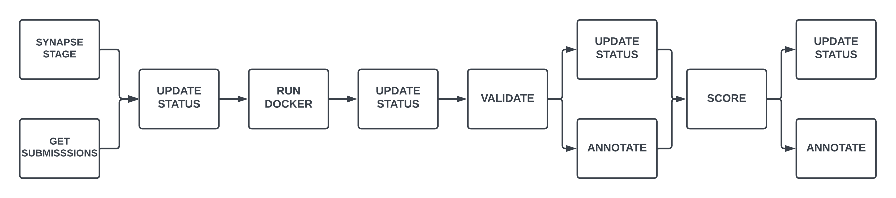
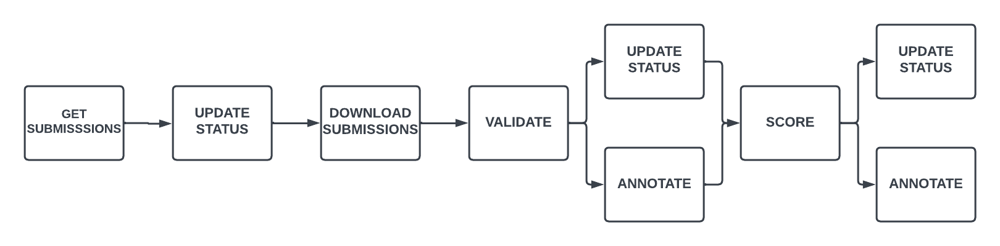

# nf-synapse-challenge

A general purpose Nextflow workflow for evaluating submissions to challenges hosted on Synapse.

## Overview

The repository is structured so that each unique challenge has its own subworkflow which is wrapped by a named workflow in `main.nf`. This allows users to invoke the workflow appropriate for their challenge by using the `entry` parameter locally:
```
nextflow run main.nf -entry {subworkflow_name} -profile local
```
or on Nextflow Tower by using the `Workflow entry name` field under `Advanced options`.

## Setup

This workflow expects a secret called `SYNAPSE_AUTH_TOKEN` (a Synapse Authentication Token). This secret should be configured in your local copy of Nextflow for local runs, or as a workspace secret in your Nextflow Tower workspace.

## Profiles

The workflow includes two preconfigured `profiles` for memory and CPU allocation. The `local` profile is equivilent to the default for model-to-data challenges (`cpus` = `4`; `memory` = `16.GB`) this is intended to be used for runs on local machines with the adequate resources. The `tower` profile dedicates double the resources (`cpus` = `8`; `memory` = `32.GB`) and can be used when running the workflow on Nextflow Tower for improved performance. 

## Supported Challenge Types

- Model-to-Data
- Data-to-Model

## Model-to-Data Challenges

### Prerequisites

In order to use this workflow, you must already have completed the following steps:

1. Created a Synapse project shared with challenge participants.
2. Created an evaluation queue within the Synapse project.
3. One or more Docker image submissions must have already been submitted to your evaluation queue.
4. Created a submission view that at least includes the `id`, `status` columns.
5. Added the input data for evaluating submissions to a folder within your Synapse project.

### Running the workflow

The workflow takes several inputs:

1. `view_id` (required): The Synapse ID for your submission view.
2. `input_id` (required): The Synapse ID for the folder holding the testing data for submissions.
3. `cpus` (optional): Number of CPUs to dedicate to the `RUN_DOCKER` process i.e. the challenge executions. Defaults to `4`
4. `memory` (optional): Amount of memory to dedicate to the `RUN_DOCKER` process i.e. the challenge executions. Defaults to `16.GB`

The Default parameter values for `view_id` and `input_id` currently point to a Synapse project that only DPE members have access to. Unless you have access to the `DPE-Testing` Synapse project, you will not be able to test this workflow using the default values.

Run the workflow locally with default inputs:
```
nextflow run main.nf -entry MODEL_TO_DATA_CHALLENGE -profile local
```

### Workflow DAG



## Data-to-Model Challenges

### Prerequisites

In order to use this workflow, you must already have completed the following steps:

1. Created a Synapse project shared with challenge participants.
2. Created an evaluation queue within the Synapse project.
3. One or more data file submissions must have already been submitted to your evaluation queue.
4. Created a submission view that at least includes the `id`, `status` columns.

### Running the workflow

The workflow requires one input:

1. `view_id` (required): The Synapse ID for your submission view.

The Default parameter value for `view_id` currently points to a Synapse project that only DPE members have access to. Unless you have access to the `DPE-Testing` Synapse project, you will not be able to test this workflow using the default values. 

Run the workflow locally with default inputs:
```
nextflow run main.nf -entry DATA_TO_MODEL_CHALLENGE -profile local
```

### Workflow DAG


